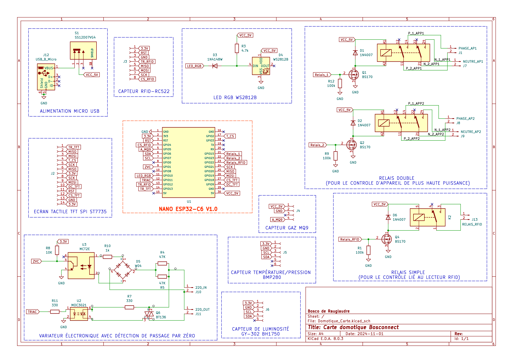

# Bosconnect - Système Domotique Intelligent
## Présentation du projet

Bosconnect est un projet de domotique visant à concevoir un système connecté polyvalent pour la surveillance et le contrôle d'un environnement domestique. Développé dans le cadre d'un projet de deuxième année de BUT GEII (Génie Électrique et Informatique Industrielle), il propose une solution complète combinant matériel personnalisé et interface web ergonomique.

 

  <figure>
    
    <figcaption><em>Vue d'ensemble de la carte domotique Bosconnect avec ses composants</em></figcaption>
  </figure>

 

## Objectifs

1. **Créer une centrale domotique accessible** permettant à tout utilisateur de surveiller et contrôler son habitat
2. **Développer une solution intégrée** associant capteurs environnementaux et contrôle d'appareils
3. **Offrir une interface intuitive** à la fois sur le dispositif physique et à distance via le web
4. **Permettre l'automatisation de tâches** basée sur des conditions temporelles ou environnementales

## Fonctionnement du système

Le système Bosconnect est basé sur deux composants fondamentaux :

### 1. Module matériel ESP32

Au cœur du système se trouve une carte électronique basée sur un ESP32 qui :
- **Collecte des données environnementales** via plusieurs capteurs (température, pression, luminosité, gaz)
- **Contrôle des appareils électriques** grâce à des relais intégrés et un variateur
- **Gère l'accès** par un système RFID pour la sécurité
- **Offre une interface locale** par écran tactile TFT
- **Communique avec le cloud** via connexion Wi-Fi

### 2. Base de données Firebase

Le système de base de données complète l'appareil physique en :
- **Stockant les données** des capteurs en temps réel
- **Permettant le contrôle à distance** des appareils connectés
- **Visualisant les tendances** par des graphiques d'historique
- **Gérant les automatisations** temporelles ou conditionnelles
- **Sécurisant l'accès** par authentification utilisateur

## Caractéristiques techniques principales

 

  <figure>
    
    <figcaption><em>Schématique de la carte domotique</em></figcaption>
  </figure>

 

- **Capteurs** : BMP280 (température/pression), BH1750 (luminosité), MQ9 (gaz)
- **Actionneurs** : 2 relais doubles, 1 variateur de puissance, 1 relais pour contrôle d'accès RFID
- **Interface locale** : Écran tactile TFT
- **Connectivité** : Wi-Fi pour connexion à la base de données
- **Plateforme de données** : Firebase (authentification, base de données en temps réel)

## Application pratique

Bosconnect peut être utilisé pour diverses applications domotiques :
- Surveillance de la qualité de l'air intérieur
- Contrôle d'éclairage intelligent (on/off et variation)
- Automatisation d'appareils électriques selon des planifications temporelles
- Sécurisation d'accès par technologie RFID
- Création de scénarios conditionnels (si température > X alors action Y)

---

## Note de sécurité

Pour des raisons de sécurité, certaines parties des configurations ont été supprimées de ce dépôt, notamment les informations d'accès à Firebase et autres données sensibles d'authentification. Ces informations sont nécessaires au fonctionnement complet du système mais ne sont pas partagées publiquement.

---

© 2024 BOSCONNECT. Développé par Bosco.